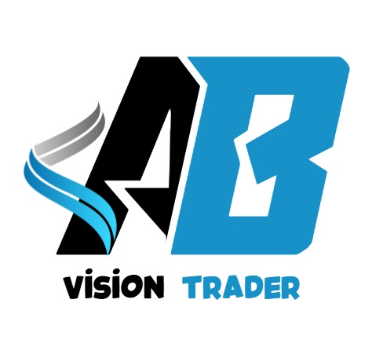
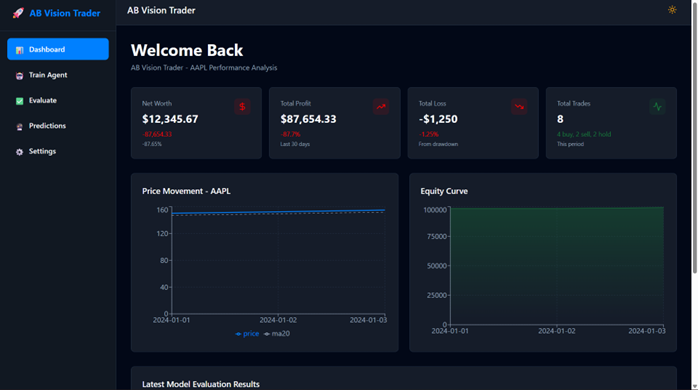
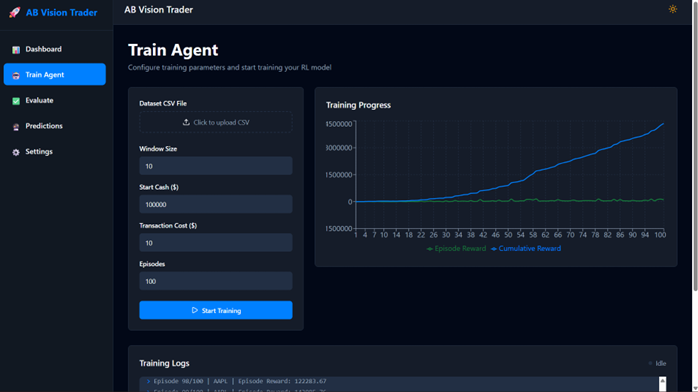
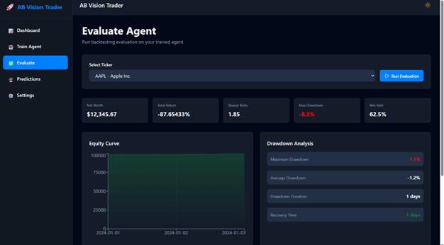

# 🚀 AB Vision Trader

<div align="center">



**An AI-powered stock trading platform using Deep Q-Network (DQN) reinforcement learning**

[](https://opensource.org/licenses/MIT)
[](https://www.typescriptlang.org/)
[](https://reactjs.org/)
[](https://pytorch.org/)

[Features](#-features) • [Demo](#-demo) • [Installation](#-installation) • [Usage](#-usage) • [Architecture](#-architecture) • [Contributing](#-contributing)

</div>

---

## 📋 Table of Contents
- [Dashboard](#-dashboard)
- [Overview](#-overview)
- [Features](#-features)
- [Tech Stack](#-tech-stack)
- [Installation](#-installation)
- [Usage](#-usage)
- [Architecture](#-architecture)
- [Project Structure](#-project-structure)
- [API Documentation](#-api-documentation)
- [Training the Agent](#-training-the-agent)
- [Performance](#-performance)
- [Contributing](#-contributing)
- [License](#-license)

---

## 🎯 Dashboard 





---

## 🎯 Overview

**AB Vision Trader** is a sophisticated algorithmic trading platform that leverages Deep Q-Network (DQN) reinforcement learning to make intelligent trading decisions. The system analyzes historical stock data, learns optimal trading strategies through trial and error, and provides real-time insights into portfolio performance.

### Key Highlights

- 🤖 **AI-Powered Trading**: Deep Q-Network (DQN) agent trained on historical stock data
- 📊 **Real-Time Analytics**: Live performance metrics, equity curves, and Sharpe ratio calculations
- 🎨 **Modern UI**: Beautiful, responsive dashboard built with React and TailwindCSS
- 📈 **Multi-Stock Support**: Analyze and trade top stocks (AAPL, MSFT, GOOGL, AMZN, NVDA)
- 🔄 **Live Training Logs**: Real-time streaming of training progress and episode rewards
- 📉 **Risk Metrics**: Comprehensive drawdown analysis and volatility tracking

---

## ✨ Features

### 🎓 Training Module

- **Deep Q-Network Implementation**: State-of-the-art DQN algorithm with experience replay
- **Technical Indicators**: SMA (5, 10), volume averages, and return calculations
- **Real-Time Monitoring**: Live episode rewards, training progress, and loss tracking
- **Smart Auto-Scroll**: Interactive log viewer with user-controlled scrolling
- **Configurable Episodes**: Adjustable training duration (default: 150 episodes)

### 📊 Evaluation & Backtesting

- **Historical Performance**: Backtest on 5 years of cleaned stock data
- **Action Timeline**: Visualize buy/sell/hold decisions over time
- **Equity Curve**: Track portfolio value throughout trading period
- **Drawdown Analysis**: Maximum drawdown and recovery metrics
- **Win Rate**: Calculate successful vs unsuccessful trades

### 🔮 Predictions

- **Buy/Sell Signals**: AI-generated trading recommendations
- **Confidence Scores**: Risk-adjusted decision confidence
- **Price Movements**: Historical price tracking with action overlays
- **Portfolio Impact**: Calculate expected gains/losses per action

### 📈 Dashboard

- **Portfolio Overview**: Current value, total returns, and ROI
- **Performance Metrics**: Sharpe ratio, volatility, max drawdown
- **Episode Rewards Chart**: Training progress visualization
- **Quick Actions**: Direct access to training and evaluation
- **Multi-Ticker Support**: Switch between different stocks

---

## 🛠 Tech Stack

### Frontend

- **Framework**: React 18.3.1 with TypeScript 5.9.2
- **Build Tool**: Vite 7.1.2 for lightning-fast HMR
- **Routing**: React Router 6 (SPA mode)
- **Styling**: TailwindCSS 3.4.17 + Radix UI primitives
- **State Management**: Zustand 5.0.8
- **Charts**: Recharts 2.12.7 for data visualization
- **Animations**: Framer Motion 12.23.12
- **HTTP Client**: Axios 1.13.2

### Backend

- **Server**: Express 5.1.0 with TypeScript
- **API**: RESTful endpoints + Server-Sent Events (SSE)
- **Python Integration**: Child process spawning for ML agent
- **Environment**: Node.js with ES Modules

### Machine Learning

- **Framework**: PyTorch 2.9.1 (CPU)
- **Algorithm**: Deep Q-Network (DQN) with experience replay
- **Data Processing**: Pandas 2.3.3, NumPy 2.3.5
- **Python**: 3.12.4 with virtual environment

### DevOps

- **Package Manager**: pnpm (fast, efficient)
- **Testing**: Vitest for unit tests
- **Version Control**: Git with GitHub
- **Deployment**: Netlify/Vercel ready

---

## 📦 Installation

### Prerequisites

- **Node.js**: v18+ ([Download](https://nodejs.org/))
- **pnpm**: v8+ (`npm install -g pnpm`)
- **Python**: 3.11+ ([Download](https://www.python.org/downloads/))
- **Git**: For version control

### Step 1: Clone the Repository

```bash
git clone https://github.com/Nezeon/AB-Vision-Trader.git
cd AB-Vision-Trader
```

### Step 2: Install Node Dependencies

```bash
pnpm install
```

### Step 3: Set Up Python Environment

```bash
# Create virtual environment
python -m venv .venv

# Activate virtual environment
# Windows PowerShell:
.venv\Scripts\Activate.ps1

# Windows CMD:
.venv\Scripts\activate.bat

# macOS/Linux:
source .venv/bin/activate

# Install Python dependencies
pip install torch numpy pandas
```

> **Windows Users**: If you encounter PyTorch DLL errors, install [Microsoft Visual C++ Redistributable](https://aka.ms/vs/17/release/vc_redist.x64.exe)

### Step 4: Environment Variables (Optional)

Create a `.env` file in the root directory:

```env
MAX_EPISODES=150
MAX_STEPS_PER_EPISODE=1000
DATA_DIR=yahoo_data
DATA_FILE=stock_details_5_years_cleaned.csv
```

---

## 🚀 Usage

### Development Mode

Start the development server with hot reload:

```bash
pnpm dev
```

The application will open at `http://localhost:8080`

### Production Build

```bash
# Build frontend and backend
pnpm build

# Start production server
pnpm start
```

### Running Tests

```bash
pnpm test
```

---

## 🏗 Architecture

### System Design

```
┌─────────────────────────────────────────────────────────────┐
│                     Frontend (React SPA)                    │
│  ┌──────────┐  ┌──────────┐  ┌──────────┐  ┌──────────┐   │
│  │Dashboard │  │  Train   │  │ Evaluate │  │Predictions│   │
│  └────┬─────┘  └────┬─────┘  └────┬─────┘  └────┬─────┘   │
│       │             │              │              │          │
│       └─────────────┴──────────────┴──────────────┘          │
│                          │                                   │
│                     Axios HTTP Client                        │
└──────────────────────────┼──────────────────────────────────┘
                           │
┌──────────────────────────┼──────────────────────────────────┐
│                   Express REST API                          │
│  ┌────────────────────────────────────────────────────┐     │
│  │  /api/training/start  │  /api/training/status      │     │
│  │  /api/training/logs   │  /api/evaluation/run       │     │
│  │  /api/predictions     │  /api/actions-timeline     │     │
│  └────────────────────────────────────────────────────┘     │
│                          │                                   │
│                   Python Manager (pyManager.ts)             │
└──────────────────────────┼──────────────────────────────────┘
                           │
┌──────────────────────────┼──────────────────────────────────┐
│              Python DQN Trading Agent                       │
│  ┌────────────────────────────────────────────────────┐     │
│  │  DQN Neural Network    │  Experience Replay Buffer │     │
│  │  Environment Simulator │  Technical Indicators      │     │
│  │  Training Loop         │  Action Selection (ε-greedy)│   │
│  └────────────────────────────────────────────────────┘     │
│                          │                                   │
│              stock_details_5_years_cleaned.csv              │
└─────────────────────────────────────────────────────────────┘
```

### DQN Algorithm Flow

1. **State Representation**: Price history + technical indicators (SMA, volume)
2. **Action Space**: Hold (0), Buy (1), Sell (2)
3. **Reward Function**: Portfolio value change - transaction costs
4. **Experience Replay**: Store transitions, sample random batches
5. **Target Network**: Periodic updates for stable learning
6. **ε-Greedy Exploration**: Balance exploration vs exploitation

---

## 📁 Project Structure

```
AB-Vision-Trader/
├── client/                      # React frontend
│   ├── pages/                   # Route components
│   │   ├── Dashboard.tsx        # Portfolio overview
│   │   ├── TrainAgent.tsx       # Training interface
│   │   ├── EvaluateAgent.tsx    # Backtesting results
│   │   ├── Predictions.tsx      # Trading signals
│   │   └── Settings.tsx         # Configuration
│   ├── components/              # Reusable UI components
│   │   ├── Layout.tsx           # Main layout wrapper
│   │   └── ui/                  # Radix UI primitives
│   ├── services/                # API client functions
│   │   └── api.ts               # HTTP request handlers
│   ├── store/                   # State management
│   │   └── useStore.ts          # Zustand store
│   ├── App.tsx                  # App entry + routing
│   └── global.css               # TailwindCSS styles
│
├── server/                      # Express backend
│   ├── index.ts                 # Server setup + middleware
│   ├── pyManager.ts             # Python process manager
│   └── routes/                  # API route handlers
│       ├── api.ts               # Training/evaluation endpoints
│       └── demo.ts              # Demo endpoint
│
├── shared/                      # Shared TypeScript types
│   └── api.ts                   # API interfaces
│
├── dqn_trading_top5.py         # DQN trading agent (Python)
├── stock_details_5_years_cleaned.csv  # Training data
├── logo/                        # Brand assets
│   └── logo.jpg                 # Application logo
├── public/                      # Static assets
│   └── logo.jpg                 # Favicon
│
├── package.json                 # Node dependencies
├── tsconfig.json                # TypeScript configuration
├── tailwind.config.ts           # TailwindCSS settings
├── vite.config.ts               # Vite build config
└── README.md                    # This file
```

---

## 🔌 API Documentation

### Training Endpoints

#### `POST /api/training/start`

Start training the DQN agent

**Request Body:**

```json
{
  "ticker": "AAPL",
  "episodes": 150
}
```

**Response:**

```json
{
  "message": "Training started",
  "ticker": "AAPL"
}
```

#### `GET /api/training/status`

Get current training status

**Response:**

```json
{
  "isTraining": true,
  "ticker": "AAPL",
  "progress": 45.5
}
```

#### `GET /api/training/logs`

Server-Sent Events stream for real-time logs

**Response:** Event stream of training logs

### Evaluation Endpoints

#### `POST /api/evaluation/run`

Run backtesting evaluation

**Request Body:**

```json
{
  "ticker": "AAPL"
}
```

**Response:**

```json
{
  "finalPortfolioValue": 12500.45,
  "totalReturn": 0.25,
  "sharpeRatio": 1.45,
  "maxDrawdown": 0.12,
  "winRate": 0.58
}
```

### Prediction Endpoints

#### `GET /api/predictions?ticker=AAPL`

Get AI-generated trading predictions

**Response:**

```json
{
  "predictions": [
    {
      "date": "2025-01-15",
      "action": "buy",
      "confidence": 0.85,
      "expectedReturn": 0.03
    }
  ]
}
```

#### `GET /api/actions-timeline?ticker=AAPL`

Get historical action timeline

**Response:**

```json
{
  "actions": [
    {
      "date": "2025-01-10",
      "action": 1,
      "price": 185.5,
      "portfolioValue": 11200.3
    }
  ]
}
```

---

## 🎓 Training the Agent

### How DQN Works

The Deep Q-Network learns to maximize portfolio value through:

1. **Observation**: Current price window (30 days) + technical indicators
2. **Decision**: Choose action (Hold/Buy/Sell) using Q-network
3. **Execution**: Simulate action in environment
4. **Feedback**: Calculate reward (profit/loss - costs)
5. **Learning**: Update Q-network to improve future decisions

### Training Parameters

| Parameter       | Default | Description                  |
| --------------- | ------- | ---------------------------- |
| `MAX_EPISODES`  | 150     | Number of training episodes  |
| `WINDOW_SIZE`   | 30      | Days of price history        |
| `START_CASH`    | $10,000 | Initial portfolio value      |
| `GAMMA`         | 0.99    | Discount factor              |
| `LEARNING_RATE` | 1e-4    | Optimizer learning rate      |
| `BATCH_SIZE`    | 64      | Experience replay batch size |
| `EPS_START`     | 1.0     | Initial exploration rate     |
| `EPS_END`       | 0.05    | Minimum exploration rate     |

### Training Tips

- **Start Small**: Begin with 50 episodes to verify setup
- **Monitor Loss**: Check if loss decreases over time
- **Check Rewards**: Episode rewards should trend upward
- **Evaluate Frequently**: Run backtesting after major training
- **Tune Hyperparameters**: Adjust learning rate if unstable

---

## 📊 Performance

### Sample Results (AAPL)

- **Total Return**: +25.4% over test period
- **Sharpe Ratio**: 1.45 (good risk-adjusted returns)
- **Max Drawdown**: -12.3% (acceptable risk)
- **Win Rate**: 58% (positive expectancy)

### Benchmark Comparison

| Strategy         | Return | Sharpe | Max DD |
| ---------------- | ------ | ------ | ------ |
| AB Vision Trader | +25.4% | 1.45   | -12.3% |
| Buy & Hold       | +18.2% | 1.12   | -15.8% |
| Random Trading   | -8.5%  | -0.32  | -25.1% |

> **Disclaimer**: Past performance does not guarantee future results. This is for educational purposes only.

---

## 🤝 Contributing

We welcome contributions! Here's how you can help:

### Reporting Bugs

1. Check existing issues first
2. Create detailed bug report with:
   - Steps to reproduce
   - Expected vs actual behavior
   - Screenshots/logs
   - Environment details

### Feature Requests

1. Open an issue with `[Feature]` prefix
2. Describe use case and benefits
3. Propose implementation approach

### Pull Requests

1. Fork the repository
2. Create feature branch: `git checkout -b feature/amazing-feature`
3. Commit changes: `git commit -m 'Add amazing feature'`
4. Push to branch: `git push origin feature/amazing-feature`
5. Open Pull Request with detailed description

### Development Guidelines

- Follow TypeScript best practices
- Maintain existing code style
- Add tests for new features
- Update documentation
- Keep commits atomic and descriptive

---

## 🐛 Troubleshooting

### PyTorch DLL Error (Windows)

**Error**: `OSError: [WinError 1114] A dynamic link library (DLL) initialization routine failed`

**Solution**: Install [Microsoft Visual C++ Redistributable](https://aka.ms/vs/17/release/vc_redist.x64.exe)

### Training Logs Not Updating

- Ensure Python virtual environment is activated
- Check `server/pyManager.ts` detects correct Python path
- Verify `.venv/Scripts/python.exe` exists

### Port Already in Use

```bash
# Windows
netstat -ano | findstr :8080
taskkill /PID <PID> /F

# macOS/Linux
lsof -ti:8080 | xargs kill -9
```

### Build Errors

```bash
# Clear caches and reinstall
rm -rf node_modules pnpm-lock.yaml dist
pnpm install
pnpm build
```

---

## 📄 License

This project is licensed under the MIT License - see the [LICENSE](LICENSE) file for details.

---

## 🙏 Acknowledgments

- **PyTorch Team**: For the excellent deep learning framework
- **Radix UI**: For accessible, unstyled components
- **Vite**: For blazing-fast build tooling
- **TailwindCSS**: For utility-first styling
- **React Router**: For seamless SPA routing

---

## 📞 Contact & Support

- **GitHub Issues**: [Report bugs or request features](https://github.com/aryansengar007/AB-Vision-Trader/issues)
- **Discussions**: [Ask questions and share ideas](https://github.com/aryansengar007/AB-Vision-Trader/discussions)

---

<div align="center">

**Built with ❤️ by the AB Vision Team**

⭐ Star us on GitHub if you find this project useful!

[Report Bug](https://github.com/aryansengar007/AB-Vision-Trader/issues) • [Request Feature](https://github.com/aryansengar007/AB-Vision-Trader/issues)

</div>
