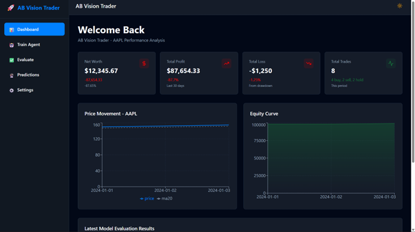
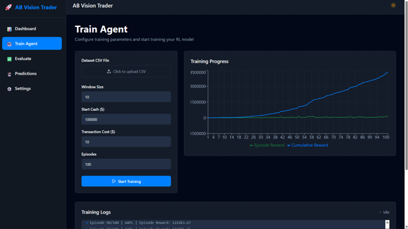
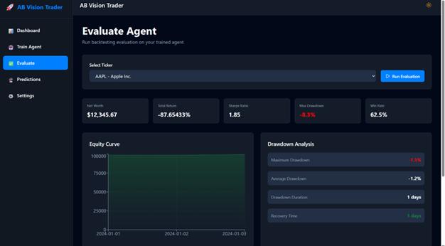

<div align="center">

<!-- ╔══════════════════════════════════════════════════════════════╗ -->
<!--                   ANIMATED WAVE HEADER                         -->
<!-- ╚══════════════════════════════════════════════════════════════╝ -->


<!-- ╔══════════════════════════════════════════════════════════════╗ -->
<!--                  ANIMATED TYPING TAGLINE                       -->
<!-- ╚══════════════════════════════════════════════════════════════╝ -->


<br/>

<!-- CTA BUTTONS -->
[](https://github.com/aryansengar007/AB-Vision-Trader)
[](https://github.com/aryansengar007/AB-Vision-Trader/issues)
[](https://github.com/aryansengar007/AB-Vision-Trader/discussions)

<br/>

<!-- ANIMATED SKILL ICONS -->


<br/><br/>

[](https://www.typescriptlang.org/)
[](https://reactjs.org/)
[](https://pytorch.org/)
[](https://vitejs.dev/)
[](https://tailwindcss.com/)
[](https://opensource.org/licenses/MIT)

</div>

<br/>

<!-- ━━━━━━━━━━━━━━━━━━━━━━━━━━━━ WAVE DIVIDER ━━━━━━━━━━━━━━━━━━━━━━━━━━━━ -->


<br/>

## 📸 Dashboard





<br/>

<!-- ━━━━━━━━━━━━━━━━━━━━━━━━━━━━ WAVE DIVIDER ━━━━━━━━━━━━━━━━━━━━━━━━━━━━ -->


<br/>

## 🎯 Overview

**AB Vision Trader** is a sophisticated algorithmic trading platform that leverages **Deep Q-Network (DQN)** reinforcement learning to make intelligent trading decisions. The system analyzes historical stock data, learns optimal trading strategies through trial and error, and provides real-time insights into portfolio performance.

<br/>

<div align="center">

| 🤖 AI Engine | 📊 Analytics | 🎨 Frontend | 📈 Coverage |
|:---:|:---:|:---:|:---:|
| DQN with experience replay | Live equity curves & Sharpe ratio | React + TailwindCSS | AAPL · MSFT · GOOGL · AMZN · NVDA |

</div>

<br/>

<!-- ━━━━━━━━━━━━━━━━━━━━━━━━━━━━ WAVE DIVIDER ━━━━━━━━━━━━━━━━━━━━━━━━━━━━ -->


<br/>

## ✨ Features

<br/>

<details>
<summary><strong>🎓 Training Module — click to expand</strong></summary>
<br/>

| Feature | Detail |
|:---|:---|
| Deep Q-Network Implementation | State-of-the-art DQN with experience replay |
| Technical Indicators | SMA (5, 10), volume averages & return calculations |
| Real-Time Monitoring | Live episode rewards, training progress & loss tracking |
| Smart Auto-Scroll | Interactive log viewer with user-controlled scrolling |
| Configurable Episodes | Adjustable training duration (default: 150 episodes) |

</details>

<details>
<summary><strong>📊 Evaluation & Backtesting — click to expand</strong></summary>
<br/>

| Feature | Detail |
|:---|:---|
| Historical Performance | Backtest on 5 years of cleaned stock data |
| Action Timeline | Visualize buy/sell/hold decisions over time |
| Equity Curve | Track portfolio value throughout trading period |
| Drawdown Analysis | Maximum drawdown & recovery metrics |
| Win Rate | Calculate successful vs unsuccessful trades |

</details>

<details>
<summary><strong>🔮 Predictions — click to expand</strong></summary>
<br/>

| Feature | Detail |
|:---|:---|
| Buy/Sell Signals | AI-generated trading recommendations |
| Confidence Scores | Risk-adjusted decision confidence |
| Price Movements | Historical price tracking with action overlays |
| Portfolio Impact | Calculate expected gains/losses per action |

</details>

<details>
<summary><strong>📈 Dashboard — click to expand</strong></summary>
<br/>

| Feature | Detail |
|:---|:---|
| Portfolio Overview | Current value, total returns & ROI |
| Performance Metrics | Sharpe ratio, volatility, max drawdown |
| Episode Rewards Chart | Training progress visualization |
| Multi-Ticker Support | Switch between different stocks instantly |

</details>

<br/>

<!-- ━━━━━━━━━━━━━━━━━━━━━━━━━━━━ WAVE DIVIDER ━━━━━━━━━━━━━━━━━━━━━━━━━━━━ -->


<br/>

## 🛠️ Tech Stack

<br/>

<div align="center">


</div>

<br/>

<details>
<summary><strong>🖥️ Frontend — click to expand</strong></summary>
<br/>

| Technology | Version | Purpose |
|:---|:---:|:---|
| React | 18.3.1 | Component-based UI framework |
| TypeScript | 5.9.2 | Type-safe development |
| Vite | 7.1.2 | Lightning-fast HMR build tool |
| React Router | 6 | SPA client-side routing |
| TailwindCSS | 3.4.17 | Utility-first styling |
| Radix UI | — | Accessible UI primitives |
| Zustand | 5.0.8 | Lightweight state management |
| Recharts | 2.12.7 | Data visualization charts |
| Framer Motion | 12.23.12 | Smooth UI animations |
| Axios | 1.13.2 | HTTP client |

</details>

<details>
<summary><strong>⚙️ Backend — click to expand</strong></summary>
<br/>

| Technology | Version | Purpose |
|:---|:---:|:---|
| Express | 5.1.0 | REST API + SSE server |
| TypeScript | — | Type-safe backend code |
| Node.js | — | Runtime + Python process spawning |

</details>

<details>
<summary><strong>🤖 Machine Learning — click to expand</strong></summary>
<br/>

| Technology | Version | Purpose |
|:---|:---:|:---|
| PyTorch | 2.9.1 (CPU) | DQN model training & inference |
| Pandas | 2.3.3 | Data loading & processing |
| NumPy | 2.3.5 | Numerical computations |
| Python | 3.12.4 | ML runtime environment |

</details>

<br/>

<!-- ━━━━━━━━━━━━━━━━━━━━━━━━━━━━ WAVE DIVIDER ━━━━━━━━━━━━━━━━━━━━━━━━━━━━ -->


<br/>

## 🏗️ Architecture

### System Design

```
┌─────────────────────────────────────────────────────────────┐
│                   Frontend (React SPA)                      │
│   Dashboard  ·  Train  ·  Evaluate  ·  Predictions         │
│                    Axios HTTP Client                        │
└──────────────────────────┬──────────────────────────────────┘
                           │
┌──────────────────────────┼──────────────────────────────────┐
│                  Express REST API                           │
│  /api/training/start  ·  /api/training/logs (SSE)          │
│  /api/evaluation/run  ·  /api/predictions                  │
│              Python Manager (pyManager.ts)                  │
└──────────────────────────┬──────────────────────────────────┘
                           │
┌──────────────────────────┼──────────────────────────────────┐
│            Python DQN Trading Agent                         │
│  DQN Neural Network  ·  Experience Replay Buffer           │
│  Environment Simulator  ·  Technical Indicators            │
│  Training Loop  ·  ε-Greedy Exploration                    │
│         stock_details_5_years_cleaned.csv                  │
└─────────────────────────────────────────────────────────────┘
```

### DQN Algorithm Flow

| Step | Process | Detail |
|:---:|:---|:---|
| 1 | **State Representation** | Price history (30d) + SMA + volume indicators |
| 2 | **Action Space** | Hold (0) · Buy (1) · Sell (2) |
| 3 | **Reward Function** | Portfolio value change minus transaction costs |
| 4 | **Experience Replay** | Store transitions, sample random batches |
| 5 | **Target Network** | Periodic updates for stable learning |
| 6 | **ε-Greedy Exploration** | Balance exploration vs exploitation |

<br/>

<!-- ━━━━━━━━━━━━━━━━━━━━━━━━━━━━ WAVE DIVIDER ━━━━━━━━━━━━━━━━━━━━━━━━━━━━ -->


<br/>

## 📁 Project Structure

<details>
<summary><strong>View full structure — click to expand</strong></summary>
<br/>

```
AB-Vision-Trader/
│
├── 📂 client/                        ← React frontend
│   ├── 📂 pages/
│   │   ├── Dashboard.tsx             ← Portfolio overview
│   │   ├── TrainAgent.tsx            ← Training interface
│   │   ├── EvaluateAgent.tsx         ← Backtesting results
│   │   ├── Predictions.tsx           ← Trading signals
│   │   └── Settings.tsx              ← Configuration
│   ├── 📂 components/
│   │   ├── Layout.tsx                ← Main layout wrapper
│   │   └── ui/                       ← Radix UI primitives
│   ├── 📂 services/
│   │   └── api.ts                    ← HTTP request handlers
│   ├── 📂 store/
│   │   └── useStore.ts               ← Zustand global state
│   ├── App.tsx                       ← App entry + routing
│   └── global.css                    ← TailwindCSS styles
│
├── 📂 server/                        ← Express backend
│   ├── index.ts                      ← Server setup + middleware
│   ├── pyManager.ts                  ← Python process manager
│   └── 📂 routes/
│       ├── api.ts                    ← Training/evaluation endpoints
│       └── demo.ts                   ← Demo endpoint
│
├── 📂 shared/
│   └── api.ts                        ← Shared TypeScript interfaces
│
├── 📄 dqn_trading_top5.py            ← DQN trading agent (Python)
├── 📄 stock_details_5_years_cleaned.csv  ← Training data
├── 📄 package.json
├── 📄 tsconfig.json
├── 📄 tailwind.config.ts
└── 📄 vite.config.ts
```

</details>

<br/>

<!-- ━━━━━━━━━━━━━━━━━━━━━━━━━━━━ WAVE DIVIDER ━━━━━━━━━━━━━━━━━━━━━━━━━━━━ -->


<br/>

## 📦 Installation

### Prerequisites

| Requirement | Version | Link |
|:---:|:---:|:---:|
| Node.js | v18+ | [nodejs.org](https://nodejs.org/) |
| pnpm | v8+ | `npm install -g pnpm` |
| Python | 3.11+ | [python.org](https://www.python.org/downloads/) |
| Git | — | For version control |

**1. Clone the repository**

```bash
git clone https://github.com/Nezeon/AB-Vision-Trader.git
cd AB-Vision-Trader
```

**2. Install Node dependencies**

```bash
pnpm install
```

**3. Set up Python virtual environment**

```bash
python -m venv .venv

# Windows PowerShell:
.venv\Scripts\Activate.ps1

# Windows CMD:
.venv\Scripts\activate.bat

# macOS / Linux:
source .venv/bin/activate

pip install torch numpy pandas
```

> ⚠️ **Windows users**: If you encounter PyTorch DLL errors, install [Microsoft Visual C++ Redistributable](https://aka.ms/vs/17/release/vc_redist.x64.exe)

**4. Environment variables** *(optional)*

Create a `.env` file in the root:

```env
MAX_EPISODES=150
MAX_STEPS_PER_EPISODE=1000
DATA_DIR=yahoo_data
DATA_FILE=stock_details_5_years_cleaned.csv
```

<br/>

<!-- ━━━━━━━━━━━━━━━━━━━━━━━━━━━━ WAVE DIVIDER ━━━━━━━━━━━━━━━━━━━━━━━━━━━━ -->


<br/>

## 🚀 Usage

**Development mode**

```bash
pnpm dev
```
> Opens at `http://localhost:8080` with hot reload.

**Production build**

```bash
pnpm build
pnpm start
```

**Run tests**

```bash
pnpm test
```

<br/>

<!-- ━━━━━━━━━━━━━━━━━━━━━━━━━━━━ WAVE DIVIDER ━━━━━━━━━━━━━━━━━━━━━━━━━━━━ -->


<br/>

## 🎓 Training the Agent

### DQN Training Parameters

| Parameter | Default | Description |
|:---:|:---:|:---|
| `MAX_EPISODES` | 150 | Number of training episodes |
| `WINDOW_SIZE` | 30 | Days of price history per state |
| `START_CASH` | $10,000 | Initial portfolio value |
| `GAMMA` | 0.99 | Discount factor |
| `LEARNING_RATE` | 1e-4 | Optimizer learning rate |
| `BATCH_SIZE` | 64 | Experience replay batch size |
| `EPS_START` | 1.0 | Initial exploration rate |
| `EPS_END` | 0.05 | Minimum exploration rate |

### Training Tips

- **Start Small** — Begin with 50 episodes to verify setup
- **Monitor Loss** — Check if loss decreases over time
- **Check Rewards** — Episode rewards should trend upward
- **Evaluate Often** — Run backtesting after major training milestones
- **Tune Hyperparameters** — Adjust learning rate if training is unstable

<br/>

<!-- ━━━━━━━━━━━━━━━━━━━━━━━━━━━━ WAVE DIVIDER ━━━━━━━━━━━━━━━━━━━━━━━━━━━━ -->


<br/>

## 📊 Performance

### Sample Results — AAPL

<div align="center">

| Strategy | Return | Sharpe Ratio | Max Drawdown |
|:---:|:---:|:---:|:---:|
| 🥇 **AB Vision Trader** | **+25.4%** | **1.45** | **-12.3%** |
| 📈 Buy & Hold | +18.2% | 1.12 | -15.8% |
| 🎲 Random Trading | -8.5% | -0.32 | -25.1% |

</div>

> ⚠️ **Disclaimer**: Past performance does not guarantee future results. This platform is for **educational purposes only** and does not constitute financial advice.

<br/>

<!-- ━━━━━━━━━━━━━━━━━━━━━━━━━━━━ WAVE DIVIDER ━━━━━━━━━━━━━━━━━━━━━━━━━━━━ -->


<br/>

## 🔌 API Documentation

<details>
<summary><strong>Training Endpoints — click to expand</strong></summary>
<br/>

**`POST /api/training/start`** — Start training the DQN agent

```json
// Request
{ "ticker": "AAPL", "episodes": 150 }

// Response
{ "message": "Training started", "ticker": "AAPL" }
```

**`GET /api/training/status`** — Get current training status

```json
{ "isTraining": true, "ticker": "AAPL", "progress": 45.5 }
```

**`GET /api/training/logs`** — SSE stream for real-time training logs

</details>

<details>
<summary><strong>Evaluation & Prediction Endpoints — click to expand</strong></summary>
<br/>

**`POST /api/evaluation/run`** — Run backtesting

```json
// Response
{
  "finalPortfolioValue": 12500.45,
  "totalReturn": 0.25,
  "sharpeRatio": 1.45,
  "maxDrawdown": 0.12,
  "winRate": 0.58
}
```

**`GET /api/predictions?ticker=AAPL`** — AI trading predictions

```json
{
  "predictions": [
    { "date": "2025-01-15", "action": "buy", "confidence": 0.85, "expectedReturn": 0.03 }
  ]
}
```

**`GET /api/actions-timeline?ticker=AAPL`** — Historical action timeline

</details>

<br/>

<!-- ━━━━━━━━━━━━━━━━━━━━━━━━━━━━ WAVE DIVIDER ━━━━━━━━━━━━━━━━━━━━━━━━━━━━ -->


<br/>

## 🔧 Troubleshooting

<details>
<summary><strong>Common Issues — click to expand</strong></summary>
<br/>

**PyTorch DLL Error (Windows)**
> Install [Microsoft Visual C++ Redistributable](https://aka.ms/vs/17/release/vc_redist.x64.exe)

**Training Logs Not Updating**
> Ensure Python venv is activated · Check `server/pyManager.ts` detects correct Python path · Verify `.venv/Scripts/python.exe` exists

**Port Already In Use**
```bash
# Windows
netstat -ano | findstr :8080
taskkill /PID <PID> /F

# macOS / Linux
lsof -ti:8080 | xargs kill -9
```

**Build Errors**
```bash
rm -rf node_modules pnpm-lock.yaml dist
pnpm install && pnpm build
```

</details>

<br/>

<!-- ━━━━━━━━━━━━━━━━━━━━━━━━━━━━ WAVE DIVIDER ━━━━━━━━━━━━━━━━━━━━━━━━━━━━ -->


<br/>

## 🤝 Contributing

We welcome contributions! Here's how:

**Reporting Bugs** — Open an issue with reproduction steps, expected vs actual behavior, and environment details.

**Feature Requests** — Open an issue with `[Feature]` prefix describing the use case and proposed approach.

**Pull Requests**

```bash
git checkout -b feature/amazing-feature
git commit -m 'Add amazing feature'
git push origin feature/amazing-feature
# → Open Pull Request with detailed description
```

> Follow TypeScript best practices · Maintain existing code style · Add tests for new features · Keep commits atomic and descriptive.

<br/>

<!-- ━━━━━━━━━━━━━━━━━━━━━━━━━━━━ WAVE DIVIDER ━━━━━━━━━━━━━━━━━━━━━━━━━━━━ -->


<br/>

## 🙏 Acknowledgements

- **PyTorch Team** — For the excellent deep learning framework
- **Radix UI** — For accessible, unstyled UI components
- **Vite** — For blazing-fast build tooling
- **TailwindCSS** — For utility-first styling
- **React Router** — For seamless SPA routing

<br/>

<!-- ╔══════════════════════════════════════════════════════════════╗ -->
<!--                   ANIMATED WAVE FOOTER                         -->
<!-- ╚══════════════════════════════════════════════════════════════╝ -->


<div align="center">

**Built with ❤️ by the AB Vision Team**

[](https://github.com/aryansengar007/AB-Vision-Trader/issues)
[](https://github.com/aryansengar007/AB-Vision-Trader/discussions)

*If you found this project useful, consider leaving a* ⭐ *— it means a lot!*

[](https://opensource.org/licenses/MIT)

</div>
